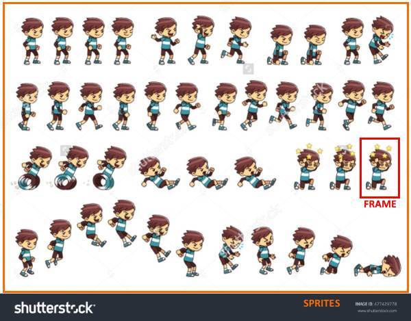

# Sprite Animation with CSS

Look the [:video_game: Demo](https://codepen.io/emoreno911/pen/Gmjgvb) at Codepen.

For some time I wanted to experiment with sprites of images and animations in css so a weekend that did not have many things to do I decided to get down to work with this mini-experiment. The first thing was to look for the sprite and since I am not an illustrator or anything like that I decided to consult with the old and reliable Google Images, it is varied the amount of sprites of characters that you can get there and in my case the main requirement to use an image was that Had the transparent background because I wanted to combine it with a video game background to be able to create motion effects when applying the animations but in my case the image that interests me had a solid white background.

 

The most direct option to get around this was to download the image to go to GIMP or Paint.Net and begin to erase the white background, a task that is quite tedious and laborious, but was refused to do that and remember a [**Pen**](https://codepen.io/shshaw/full/tKpdl) that I had seen a while ago in which they created a transparency effect on a JPG image via SVG. This technique consists of using two images the first is the normal image without modification and the second is a black and white image where the black areas represent the area of ​​the image where there should be transparency, then these two images are loaded within a Container SVG and the second image is used as a mask for the alpha channel, this creates transparency.

To easily create the image for the alpha channel you can use Paint.net, there modifies the original image with the settings menu by lowering the brightness to the minimum, then increasing the contrast to the maximum and to finish inverting the colors. This is the result

 

To generate the SVG with transparency you use the [**Pen**](https://codepen.io/shshaw/full/tKpdl) mentioned above, the following is to create a FrameContainer where the CSS animations will be applied to the sprite, this Must span the size of an individual frame and its background is the sprite.svg file generated earlier.

When we see the sprite we notice that it contains different types of movements for the character like walking, running, jumping, etc. What we have to do is create a CSS animation for each movement, taking into account which frames we have to combine and the "movement" will be recreated by the changes that we make in the background-position property of the FrameContainer. It should be noted that the animation must have as many [**Steps**](https://css-tricks.com/using-multi-step-animations-transitions) as frames contain movement in the sprite.

And lastly the movement of the background is done by moving that image on the X axis with the function of CSS translateX and the help of [**requestAnimationFrame**](https://developer.mozilla.org/en/docs/Web/API/Window/RequestAnimationFrame)
